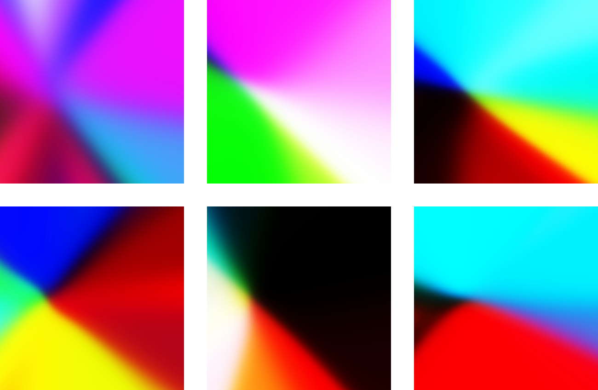
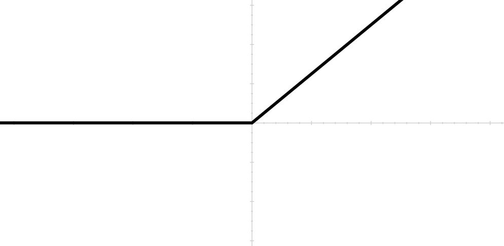

% A Visual Exploration of Random Neural Networks
% Tyler Neylon
% 533.2018

\newcommand{\R}{\mathbb{R}}
\newcommand{\Z}{\mathbb{Z}}
\newcommand{\eqnset}[1]{\left.\mbox{$#1$}\;\;\right\rbrace\class{postbrace}{ }}
\providecommand{\optquad}{\class{optquad}{}}
\providecommand{\smallscrneg}{\class{smallscrneg}{ }}
\providecommand{\bigscr}[1]{\class{bigscr}{#1}}
\providecommand{\smallscr}[1]{\class{smallscr}{#1}}
\providecommand{\smallscrskip}[1]{\class{smallscr}{\hskip #1}}

\providecommand{\flexquad}{\quad\smallscrskip{-0.8em}}
\providecommand{\flexspace}{\;\;\smallscrskip{-0.3em}}

This is an illustrated tour of neural networks in their primordial, untrained
state. Neural networks are notoriously difficult beasts to understand, and my
aim is to provide both a peek into the inherent beauty of this world, as well as
to help you build a bit of intuition to help you shape your initial model ---
specifically, by an informed choice of hyperparameters. I'll assume you know
that neural networks are tools for machine learning, and that you have a little
bit of a coding and math background, but I'll try to keep things friendly.

A random neural network looks like this:

{#fig:fig1}

Why not be even more ambitious and throw in a few more dimensions?
Here's an animated cross-sectional view of another random network:

{#fig:fig2}

These are graphs of a specific type of model called a *feedforward neural
network*, also known as a *multilayer perceptron*. In this post, I'll show you
how this kind of network is built out of simpler mathematical pieces. I'll also
visually show how many of the hyperparameter values for these models affect
their behavior. Hyperparameters are values like the number of layers, layer
size, or the distribution used to set the initial weights.

[@Fig:fig1] above shows a mathematical function that accepts two inputs as
$x$ and $y$ coordinates, and provides three outputs as red, green, and blue
intensities for a given pixel. If I were to define such a function in Python, it
would look a bit like this:

```
def neural_net(x, y):

  # Compute r, g, and b using x and y.
  return r, g, b
```

A critical property of neural networks is that they are parametrizable through
weight values you can adjust. Mathematically, we could choose to think of a
neural network as a function $f(x, w)$ where both $x$ and $w$ are vectors. From
this perspective, $w$ are the weights that are learned during training from a
fixed set of data. Once training is complete, the vector $w$ remains fixed,
while the function receives previously-unseen input values for $x,$ and we think
of the $x$ values as the data from which we predict the desired output.

Feedforward neural networks have a particular form. They're built with weight
matrices $W_1, W_2, \ldots,$ bias vectors $b_1, b_2, \ldots,$ and activation
functions $a_1(), a_2(), \ldots.$ A three-layer feedforward network is built
like so:

$$\begin{cases}
y_0 = x \\
y_1 = a_1(W_1 y_0 + b_1) \\
y_2 = a_2(W_2 y_1 + b_2) \\
y_3 = a_3(W_3 y_2 + b_3) \\
f(x, w) = y_3 \\
\end{cases}
$$

# A Single Layer

Let's take a look at a simple instance, and build our way up to the more
sophisticated picture. Consider a single-layer model with matrix $W_1$ having
weights given by $w_{11} = 0.4$ and $w_{12} = 1.0,$ bias term $b_1=-0.3,$ and
the sigmoid activation function:

$$\sigma(x) = \frac{1}{1 + e^{-x}}.$$ {#eq:eq1}

Given inputs $x_1$ and $x_2,$ we can summarize the entire neural network as a
relatively simple function:

$$f(x) = a_1(W_1x + b_1) = \frac{1}{1+e^{-0.4x_1-x_2+0.3}}.$$ {#eq:eq2}

We can visualize this function as a 3d height plot, shown below in [@fig:fig3].
Since the output values are constrained to the [0, 1] interval by the sigmoid
function, we can also render the same plot as a pixel intensity image --- this
is basically a bird's eye view in which values close to 1 appear white, values
close to 0 appear black, and values between provide a gradient of grays.

![On the left is the sigmoid function $\sigma(x)$ defined by ([@eq:eq1]).
In the middle is a 3d heightmap of the single-layer, one-output neural network
defined by ([@eq:eq2]). On the right is the overhead view of this same function.
](images/gray_sigmoid.png){#fig:fig3}

Here we see a single output value because our weight matrix $W_1$ had a
single row. A layer can have multiple outputs, corresponding to multiple rows
in its weight matrix, and a correspondingly sized bias vector (eg, $W_1$ and
$b_1$).
Before the activation function is applied, each output can be seen as either
a flat hyperplane (viewed as a heightmap), or as a linear color gradient
(viewed as
pixel intensities). After the activation, the outputs become nonlinear. If
the activation function is $\sigma(x)$ or $\tanh(x)$, then the outputs are
mapped
into a bounded interval; you might say that the hyperplanes have been flattened
so that the ends become flat, and there is a section of curvature in the middle.

# The Second Layer

Let’s dig a bit deeper into the rabbit hole and see what the next layer can do.
Suppose the neural network has a single 1-dimensional input,
and that it uses a $\tanh()$
activation function. Then the output of the first layer is a series of
similarly-shaped curves at different scales and locations (curves like this
are often called *s-curves*); these are at left in the figure below. If we add
together scaled version of these (in other words, if we take a *linear
combination* of these), then we get a
curve that, in a sense, has access to as many
inflection points (intuitively, “turning points”) as it has inputs. An
example is in the middle of the figure below. The final output of the second
layer is the result of applying the activation function to this linear
combination. The right side of the figure shows $\tanh()$ applied to the middle
of the figure.

{#fig:fig4}

If we have more than a single input variable, then the outputs of the first
layer look like those in [@fig:fig3] (for a $\tanh()$ or $\sigma()$
activation function),
and the linear combinations of these can be more interesting since the
inflection points turn into inflection *lines* (or *hyperplanes* in higher
dimensions). The figure below is analogous to [@fig:fig4] just above; the change
is that we now have two input variables instead of one.

{#fig:fig5}

If we have three different output values in the range [0, 1], then we can
visualize all three at once by interpreting them as independent red, green,
and blue channels, like so:

{#fig:fig6}

The original figures in this article ([@fig:fig1] and [@fig:fig2])
use this technique to render all 3 output values of a neural network in a single
image.

To wrap up, here are typical one-layer networks:

{#fig:fig7}

Below are typical two-layer networks. Each of the following networks has 10
hidden units in its first layer.

{#fig:fig8}

The weights in all of those have been randomly chosen, and I'll mention the
probability distribution used for them in a few moments.

# The Deep Part of Deep Learning

This section visualizes how networks change as we add more layers to them.

The word *deep* in *deep learning* refers to the fact that many of today's more
sophisticated neural networks tend to have many layers. Continuing naturally in
our progression from 1- to 2-layer networks, what do networks with 3 or nore
layers look like?

Here's a progression:

{#fig:fig9}

In the figure above, each row shows the output of successive layers of a
feedforward neural network with random weights. The iages in the first column
are from the first layer; those in the second column are from the second layer;
and so on. To phrase things intuitively, I'd say that deeper networks can
capture a greater level of complexity in terms of behavior.

# Activation Functions

So far we've looked at sigmoidal activation functions --- $\sigma()$ and
$\tanh().$ Another popular choice is $\text{relu}(x) = \max(x, 0).$

{#fig:fig10}

In machine learning folklore, it is said that relu-based networks train more
quickly than the sigmoidals. This may be true because, for positive $x$ values,
$\text{relu}(x)$ has a derivative far from zero, whereas both $\tanh()$ and
$\sigma()$ have small derivatives for large $x$ values. Functions with small
derivatives result in slower convergence via gradient descent, making
$\text{relu}()$ the better choice from this perspective.


---

# References
